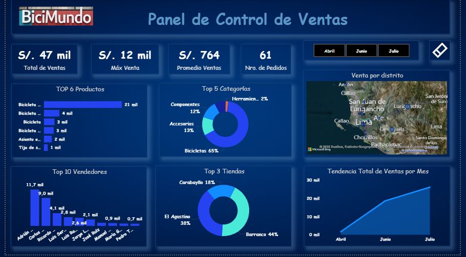

# 📊 Dashboard — BiciMundo

Panel de Control de Ventas desarrollado en dos herramientas para mayor accesibilidad.

> 💡 La imagen muestra una vista estática. Para explorar la interactividad, descarga el archivo correspondiente.

---

## 📁 Archivos

### `Dashboard_BiciMundo_PBI.pbix` — Power BI ⭐ Recomendado
Dashboard interactivo con filtros por mes, mapa de ventas por distrito y visualizaciones dinámicas.
Requiere [Power BI Desktop](https://powerbi.microsoft.com/desktop) (gratuito).

### `Dashboard_BiciMundoEXCEL.xlsx` — Excel
Versión del dashboard conectada a SSAS local con el cubo BiciMundo deployado.
⚠️ Requiere conexión al servidor SSAS para funcionar correctamente.

---

## 📌 Métricas principales

| Indicador | Valor |
|---|---|
| Total de Ventas | S/. 47 mil |
| Máx. Venta | S/. 12 mil |
| Promedio de Ventas | S/. 764 |
| Nro. de Pedidos | 61 |